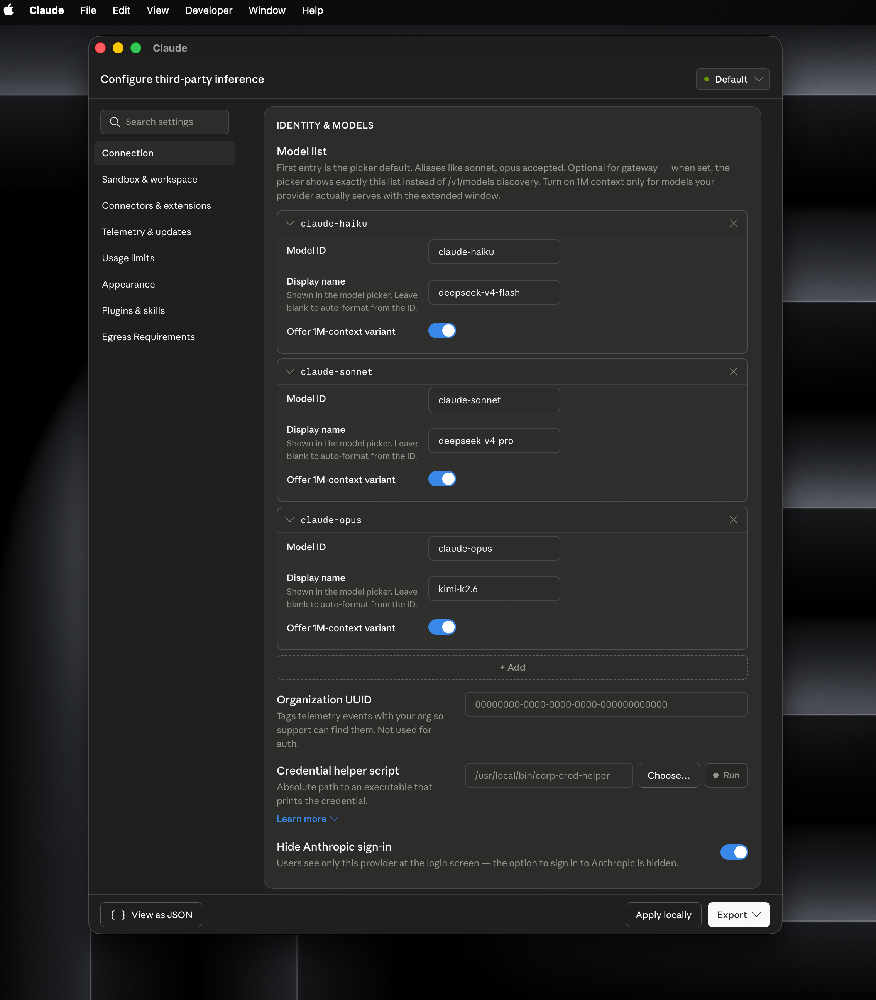

# Claude model proxy

[中文文档](README.zh-CN.md)

Claude Desktop can point its gateway at this proxy while requests are routed by
real model name to DeepSeek, Moonshot/Kimi, GLM, Xiaomi MiMo, OpenAI, Gemini,
Qwen, or Anthropic upstreams. The default model list exposes real upstream model
names:

| Request model | Upstream provider | Upstream model |
| --- | --- | --- |
| `claude-haiku-4-5` | Anthropic | `claude-haiku-4-5` |
| `claude-sonnet-4-6` | Anthropic | `claude-sonnet-4-6` |
| `claude-opus-4-7` | Anthropic | `claude-opus-4-7` |
| `deepseek-v4-flash` | DeepSeek | `deepseek-v4-flash` |
| `deepseek-v4-pro` | DeepSeek | `deepseek-v4-pro` |
| `kimi-k2.6` | Moonshot/Kimi | `kimi-k2.6` |
| `glm-4.5-air` | GLM | `glm-4.5-air` |
| `glm-4.7` | GLM | `glm-4.7` |
| `glm-5.1` | GLM | `glm-5.1` |
| `mimo-v2-flash` | Xiaomi MiMo | `mimo-v2-flash` |
| `mimo-v2-pro` | Xiaomi MiMo | `mimo-v2-pro` |
| `mimo-v2.5-pro` | Xiaomi MiMo | `mimo-v2.5-pro` |
| `qwen-flash` | Qwen | `qwen-flash` |
| `qwen-plus` | Qwen | `qwen-plus` |
| `qwen-max` | Qwen | `qwen-max` |
| `gpt-5.4-mini` | OpenAI | `gpt-5.4-mini` |
| `gpt-5.4` | OpenAI | `gpt-5.4` |
| `gpt-5.5` | OpenAI | `gpt-5.5` |
| `gemini-3.1-flash-lite-preview` | Gemini | `gemini-3.1-flash-lite-preview` |
| `gemini-3-flash-preview` | Gemini | `gemini-3-flash-preview` |
| `gemini-3.1-pro-preview` | Gemini | `gemini-3.1-pro-preview` |

Claude semantic aliases are configured separately so newer Claude clients do
not need fake provider-prefixed Claude aliases:

| Claude alias | Default upstream model |
| --- | --- |
| `claude-haiku` | `deepseek-v4-flash` |
| `claude-sonnet` | `deepseek-v4-pro` |
| `claude-opus` | `deepseek-v4-pro` |

When a request uses one of these aliases, the proxy sends the mapped real model
to the upstream provider and rewrites the response model back to the alias used
for that call. OpenAI, Gemini, and Qwen models are adapted through their
OpenAI-compatible Chat Completions APIs.

## Requirements

- Node.js 18 or newer
- Claude Desktop with Gateway / third-party inference configuration
- At least one provider API key for the models you plan to use

## Run

```sh
cp .env.example .env
# Edit .env and fill in the provider keys you need.
set -a
. ./.env
set +a
npm start
```

If `npm start` fails with `env: node: No such file or directory`, use the
included launcher instead. It uses the default `node` on `PATH`; if Node.js 18+
is not available on macOS and Homebrew is installed, it attempts `brew install
node` automatically.

```sh
export DEEPSEEK_API_KEY="sk-..."
export MOONSHOT_API_KEY="sk-..."
export GLM_API_KEY="sk-..."
export XIAOMI_API_KEY="sk-..."
export DASHSCOPE_API_KEY="sk-..."
export ANTHROPIC_API_KEY="sk-ant-..."
export OPENAI_API_KEY="sk-..."
export GEMINI_API_KEY="..."
./start.sh
```

`start.sh` starts the proxy in the background by default and writes
`claude-model-proxy.pid` plus `claude-model-proxy.log`. Common commands:

```sh
./start.sh status
./start.sh stop
./start.sh restart
./start.sh foreground
```

Set `CLAUDE_MODEL_PROXY_AUTO_INSTALL_NODE=0` before running `./start.sh` to
disable automatic Homebrew install attempts.

The proxy listens locally on the same URL you should configure as the gateway
base URL:

```text
http://127.0.0.1:8787
```

## Configuration

Environment variables:

- `BASE_URL`: gateway-facing base URL. Default: `http://127.0.0.1:8787`.
- `PORT`: local listen port. Default: `8787`.
- `ADVANCED_ENV`: JSON object used by the extension installer for optional
  provider keys and advanced overrides.
- `DEEPSEEK_BASE_URL`: DeepSeek-compatible API base URL. Default:
  `https://api.deepseek.com/anthropic`.
- `DEEPSEEK_API_KEY`: DeepSeek API key.
- `MOONSHOT_BASE_URL`: Moonshot/Kimi-compatible API base URL. Default:
  `https://api.moonshot.cn/anthropic`.
- `MOONSHOT_API_KEY`: Moonshot/Kimi API key.
- `GLM_BASE_URL`: Z.AI/GLM-compatible API base URL. Default:
  `https://api.z.ai/api/anthropic`.
- `GLM_API_KEY`: Z.AI/GLM API key. `ZAI_API_KEY` and `ZHIPU_API_KEY` are also
  accepted aliases.
- `XIAOMI_BASE_URL`: Xiaomi MiMo-compatible API base URL. Default:
  `https://api.xiaomimimo.com/anthropic`.
- `XIAOMI_API_KEY`: Xiaomi MiMo API key. `MIMO_API_KEY` is also accepted.
- `ANTHROPIC_BASE_URL`: Anthropic Messages API base URL. Default:
  `https://api.anthropic.com`.
- `OPENAI_BASE_URL`: OpenAI Chat Completions API base URL. Default:
  `https://api.openai.com/v1`.
- `GEMINI_BASE_URL`: Gemini OpenAI-compatible API base URL. Default:
  `https://generativelanguage.googleapis.com/v1beta/openai`.
- `QWEN_BASE_URL`: Qwen/DashScope OpenAI-compatible API base URL. Default:
  `https://dashscope.aliyuncs.com/compatible-mode/v1`.
- `ANTHROPIC_API_KEY`: Anthropic API key. Sent as `x-api-key`.
- `OPENAI_API_KEY`: OpenAI API key.
- `GEMINI_API_KEY`: Gemini API key. `GOOGLE_API_KEY` is also accepted.
- `QWEN_API_KEY`: Qwen/DashScope API key (or `DASHSCOPE_API_KEY`).
- `CLAUDE_MODEL_MAP`: Claude semantic alias -> real upstream model name. JSON
  object or `from=to,from2=to2`. Default:
  `{"claude-haiku":"deepseek-v4-flash","claude-sonnet":"deepseek-v4-pro","claude-opus":"deepseek-v4-pro"}`.
- `MODEL_MAP`: request model name -> upstream model name. JSON object or
  `from=to,from2=to2`.
- `MODEL_ALIASES`: upstream model name -> response model alias. JSON object or
  `from=to,from2=to2`. Defaults to real model names.
- `MODEL_ROUTES`: upstream model name -> provider name. Provider names are
  `deepseek`, `moonshot`, `glm`, `xiaomi`, `openai`, `gemini`, `qwen`, and
  `anthropic`.
- `REWRITE_RESPONSES`: set to `false` to stop rewriting response model names.

Default mapping values:

```sh
CLAUDE_MODEL_MAP='{"claude-haiku":"deepseek-v4-flash","claude-sonnet":"deepseek-v4-pro","claude-opus":"deepseek-v4-pro"}'
MODEL_MAP='{"deepseek-v4-flash":"deepseek-v4-flash","deepseek-v4-pro":"deepseek-v4-pro","kimi-k2.6":"kimi-k2.6","glm-4.5-air":"glm-4.5-air","glm-4.6":"glm-4.6","glm-4.7":"glm-4.7","glm-5":"glm-5","glm-5.1":"glm-5.1","mimo-v2-flash":"mimo-v2-flash","mimo-v2-pro":"mimo-v2-pro","mimo-v2.5-pro":"mimo-v2.5-pro","mimo-v2-omni":"mimo-v2-omni","gpt-5.5":"gpt-5.5","gpt-5.4":"gpt-5.4","gpt-5.4-mini":"gpt-5.4-mini","gemini-3.1-pro-preview":"gemini-3.1-pro-preview","gemini-3-flash-preview":"gemini-3-flash-preview","gemini-2.5-pro":"gemini-2.5-pro","gemini-2.5-flash":"gemini-2.5-flash","gemini-3.1-flash-lite-preview":"gemini-3.1-flash-lite-preview","gemini-2.0-flash":"gemini-2.0-flash","qwen-flash":"qwen-flash","qwen-plus":"qwen-plus","qwen-max":"qwen-max","claude-haiku-4-5":"claude-haiku-4-5","claude-sonnet-4-6":"claude-sonnet-4-6","claude-opus-4-7":"claude-opus-4-7","claude-sonnet-4-5":"claude-sonnet-4-5","claude-opus-4-1":"claude-opus-4-1"}'
MODEL_ROUTES='{"deepseek-v4-flash":"deepseek","deepseek-v4-pro":"deepseek","kimi-k2.6":"moonshot","glm-4.5-air":"glm","glm-4.6":"glm","glm-4.7":"glm","glm-5":"glm","glm-5.1":"glm","mimo-v2-flash":"xiaomi","mimo-v2-pro":"xiaomi","mimo-v2.5-pro":"xiaomi","mimo-v2-omni":"xiaomi","gpt-5.5":"openai","gpt-5.4":"openai","gpt-5.4-mini":"openai","gemini-3.1-pro-preview":"gemini","gemini-3-flash-preview":"gemini","gemini-2.5-pro":"gemini","gemini-2.5-flash":"gemini","gemini-3.1-flash-lite-preview":"gemini","gemini-2.0-flash":"gemini","qwen-flash":"qwen","qwen-plus":"qwen","qwen-max":"qwen","claude-haiku-4-5":"anthropic","claude-sonnet-4-6":"anthropic","claude-opus-4-7":"anthropic","claude-sonnet-4-5":"anthropic","claude-opus-4-1":"anthropic"}'
```

## Health check

```sh
curl http://127.0.0.1:8787/healthz
```

## Claude Code

Claude Code can use this proxy through its Anthropic-compatible environment
variables. Start the proxy first, then source the Claude Code client environment
in the terminal where you run `claude`:

```sh
cp .env.claude-code.example .env.claude-code
# Edit .env.claude-code if you want different model aliases.
set -a
. ./.env.claude-code
set +a
claude
```

The default Claude Code example maps its aliases to these proxy models:

```sh
ANTHROPIC_DEFAULT_HAIKU_MODEL=claude-haiku
ANTHROPIC_DEFAULT_SONNET_MODEL=claude-sonnet
ANTHROPIC_DEFAULT_OPUS_MODEL=claude-opus
CLAUDE_CODE_SUBAGENT_MODEL=claude-haiku
ANTHROPIC_MODEL=sonnet
```

You can also start Claude Code with a specific proxy model directly:

```sh
ANTHROPIC_BASE_URL=http://127.0.0.1:8787 \
ANTHROPIC_API_KEY=dummy-claude-model-proxy \
claude --model deepseek-v4-pro
```

`ANTHROPIC_API_KEY` is only a non-empty client-side placeholder for this proxy.
Provider API keys still come from the proxy's `.env`, MCPB install settings, or
LaunchAgent environment file.

Claude Code works best with Anthropic Messages-compatible upstreams such as
DeepSeek, Moonshot/Kimi, GLM, Xiaomi MiMo, and Anthropic because tool-use
payloads are passed through as-is. OpenAI, Gemini, and Qwen routes use a basic
Chat Completions adapter for text/image and streaming responses; they are not a
full Claude Code tool-use compatibility layer.

## Claude Desktop extension

Build the installable MCPB extension:

```sh
npm run build:mcpb
```

The output is:

```text
dist/claude-model-proxy-0.1.1.mcpb
```

Install it in Claude Desktop from Settings -> Extensions / Connectors ->
Advanced settings -> Install Extension. During first installation, fill in the
gateway URL, local port, whichever provider API key you use, and the Claude
Model Map if you want aliases to point somewhere else. DeepSeek and
Moonshot/Kimi Base URL fields are optional because the extension already
provides the official defaults; only change them when you use a custom endpoint.
Optional providers and lower-level overrides can be supplied through the
advanced JSON field.

For a single-provider setup, leave every other provider key blank. For example,
if you only use Moonshot/Kimi, fill `Moonshot API Key`, leave `DeepSeek API Key`
blank, and set `Claude Model Map` so Claude semantic aliases resolve to
Moonshot models:

```json
{
  "claude-haiku": "kimi-k2.6",
  "claude-sonnet": "kimi-k2.6",
  "claude-opus": "kimi-k2.6"
}
```

If you only use DeepSeek, fill `DeepSeek API Key`, leave `Moonshot API Key`
blank, and keep or adjust the default map:

```json
{
  "claude-haiku": "deepseek-v4-flash",
  "claude-sonnet": "deepseek-v4-pro",
  "claude-opus": "deepseek-v4-pro"
}
```

The same rule applies to providers configured through
`Optional Advanced Settings JSON`: provide only that provider's key and map the
Claude aliases to real model names served by that provider.

After the extension is installed, open Claude Desktop settings and configure
third-party inference as shown below. If the third-party inference or extension
controls are hidden, enable Developer Mode first.



Use these values:

- Provider: `Gateway`
- Gateway base URL: `http://127.0.0.1:8787`
- Gateway API key: any non-empty placeholder, for example
  `dummy-claude-model-proxy`
- Gateway auth scheme: `bearer`
- Model list: add the real model names you want to expose, such as
  `deepseek-v4-flash`, `deepseek-v4-pro`, `kimi-k2.6`, `qwen-flash`,
  `qwen-plus`, or `qwen-max`

Provider API keys are configured in the extension installer or environment
variables, not in the Gateway API key field.

The extension exposes a `model_proxy_status` tool so you can inspect local proxy
status, providers, and model mappings from Claude.

In Claude Desktop settings, this appears under Tool permissions as
`Other tools -> Model proxy status`. If its permission is `Needs approval`,
Claude will ask before each tool call. The tool is annotated as read-only and
non-destructive, so new installs on clients that honor MCP annotations should be
able to default it to no approval; existing user permission overrides may need
to be changed once in settings. In a Claude chat, ask:

```text
Use the Model proxy status tool to check whether Claude Model Proxy is running.
```

or:

```text
Call model_proxy_status and tell me whether the proxy is listening and whether
API keys are configured.
```

The returned JSON includes `listening`, `error`, `external`, `localUrl`,
provider `hasApiKey` flags, and the active model mappings. You can also inspect
similar status from a terminal:

```sh
curl http://127.0.0.1:8787/healthz
```

If a brand-new chat says `model_proxy_status` is unavailable but the same
request works immediately on retry, Claude started the model response before it
had refreshed the MCPB tool list. The extension declares a fixed static tool
list in the bundle metadata and marks `model_proxy_status` as read-only so
clients can discover and approve it early. If the first already-started response
was built without tools, retry the request once or open the chat after Claude
Desktop has finished loading the extension. Keeping the proxy itself running as
a LaunchAgent also avoids the separate gateway-listening race described below.

## Avoid the startup warning

Claude Desktop can probe the gateway before the MCPB extension process has
finished starting. When that happens, Claude shows "Can't reach 127.0.0.1:8787"
until you click "Check again".

For a clean startup, run the proxy as a macOS LaunchAgent so it is already
listening before Claude starts:

```sh
npm run launch-agent:install
```

The installer creates `~/.claude-model-proxy.env`. Put the same provider keys in
that file, then restart the agent:

```sh
launchctl kickstart -k gui/$(id -u)/local.claude-model-proxy
curl http://127.0.0.1:8787/healthz
```

The MCPB extension can still stay installed. If it sees the LaunchAgent already
owning port `8787`, its status reports the proxy as externally running instead
of treating the port conflict as a failure.

To remove the LaunchAgent:

```sh
npm run launch-agent:uninstall
```

## Extension install UI

The MCPB installer shows the gateway/proxy basics, optional DeepSeek and
Moonshot/Kimi credentials, and the Claude Model Map by default. Less common
provider credentials and low-level mapping overrides stay available through one
optional advanced JSON field:

```json
{
  "GLM_API_KEY": "...",
  "XIAOMI_API_KEY": "...",
  "ANTHROPIC_API_KEY": "sk-ant-...",
  "OPENAI_API_KEY": "sk-...",
  "GEMINI_API_KEY": "...",
  "QWEN_API_KEY": "sk-..."
}
```

The advanced field accepts any environment variable listed below, including
`CLAUDE_MODEL_MAP`, `MODEL_MAP`, `MODEL_ALIASES`, `MODEL_ROUTES`, and
`REWRITE_RESPONSES`.

## Project layout

```text
.
├── manifest.json              # MCPB extension manifest
├── proxy.mjs                  # HTTP gateway proxy and provider adapters
├── server/index.mjs           # MCP stdio server that starts the proxy
├── scripts/                   # Build, launchd, and Node helper scripts
├── srcs/                      # README screenshots and images
├── test/proxy.test.mjs        # Node test suite
├── start.sh                   # Standalone launcher
├── .env.claude-code.example   # Claude Code client configuration template
└── .env.example               # Safe local configuration template
```

Generated files under `dist/`, local `.env` files, logs, editor files, and
dependencies are ignored by `.gitignore`.

## Notes

DeepSeek, Moonshot/Kimi, GLM, Xiaomi MiMo, and Anthropic are treated as
Anthropic Messages-compatible upstreams. OpenAI, Gemini, and Qwen are adapted
through their OpenAI-compatible Chat Completions endpoints. The adapter covers
normal text and image message content plus streaming text deltas; Anthropic
tool-use blocks, audio, and provider-specific advanced options are intentionally
left as upstream-specific behavior.
